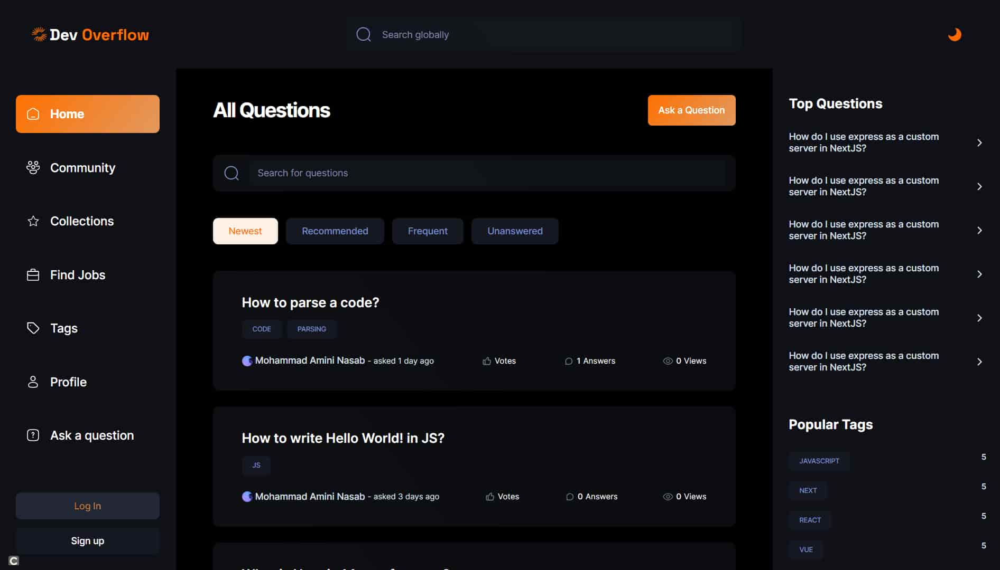

# Stack Overflow Clone

Welcome to the Stack Overflow Clone, a project aimed at replicating the core functionality of the popular Stack Overflow website. This clone provides a platform for users to ask and answer questions, share knowledge, and engage in discussions within a community-driven environment.

## Features

1. **Question and Answer Platform:** Users can post questions and receive answers from the community.
2. **Voting System:** Upvote or downvote questions and answers to highlight valuable content.
3. **User Authentication:** Secure user authentication to manage accounts and contributions.
4. **Search Functionality:** Effortlessly find relevant questions and answers using the search feature.
5. **Tagging System:** Categorize questions with tags for easy navigation and filtering.
6. **Advanced Filters:** Utilize advanced filters to refine search results and tailor content to specific criteria.
7. **Pagination:** Navigate through lists of questions and answers conveniently with a paginated interface.
8. **Markdown Support:** Write and format questions and answers using Markdown for enhanced readability.
9. **Responsive Design:** Ensures a seamless experience across various devices.
10. **Integration of ChatGPT:** Explore the integration of ChatGPT for enhanced conversational interactions within the community.

## Technologies Used

- **Next.js 14:** React framework for building a fast and efficient frontend.
- **Tailwind CSS:** Utility-first CSS framework for styling.
- **MongoDB:** NoSQL database for storing and retrieving user and content data.
- **React Hook Form:** Library for managing forms in React applications.
- **Zod:** TypeScript-first schema declaration and validation library.

## Contact Information

For any inquiries, feedback, or collaboration opportunities, feel free to reach out:

- [**Email**](mailto:mo.amininasabb@gmail.com)
- [**GitHub**](https://github.com/mo-amininasab)
